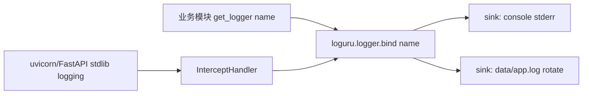

## 用户需求
将 TennisClip AI 后端（FastAPI + uvicorn）的日志系统由 Python 标准 `logging` 替换为 `loguru`。

## 产品概述
为后台服务提供一套统一、结构化、带滚动文件落盘的日志体系，覆盖项目自研模块与 uvicorn/FastAPI 内置日志，并支持通过 `config.yaml` 与环境变量灵活控制日志级别。

## 核心特性
- 重写 `app/utils/logger.py`，以 `loguru.logger` 单例为核心，对外保持 `get_logger(name)` 接口兼容（现有 12 处调用点无需改动）。
- 双输出目标：控制台（stderr）实时输出 + 滚动文件日志 `backend/data/app.log`（rotate=10MB、retention=7days、压缩 zip），便于离线排查。
- 统一拦截 uvicorn / FastAPI 标准 `logging`，经 `InterceptHandler` 汇入 loguru 同一套格式，保证全链路日志风格一致。
- 日志级别来源：环境变量 `TENNISCLIP_LOG_LEVEL`（覆盖）> `config.yaml` 的 `logging.level`（经 `AppConfig.logging_level`）> 默认 `INFO`。


## 技术栈
- 后端：Python 3.14 + FastAPI + uvicorn（现有）
- 新增依赖：`loguru>=0.7`（经 `uv` 管理）
- 配置：`config.yaml` 的 `logging.level` + 环境变量（现有 `AppConfig` 已加载 yaml 级别）

## 实现方案
### 总体策略
采用「单例 + 幂等初始化」模式重写 `logger.py`：进程内 `loguru.logger` 为唯一日志入口；首次调用 `get_logger` 时（或在模块导入期）完成 sink 配置与标准 logging 拦截挂载。通过 `logger.bind(name=name)` 让用户模块名出现在 `{extra[name]}` 字段，从而维持现有 `get_logger(name)` 调用契约，不触碰 12 处业务代码。

### 关键技术决策
1. **接口兼容优先**：保留 `get_logger(name, level=None)` 签名，返回 loguru 的 `Logger`（绑定 name）。收益：零侵入现有代码；代价：返回类型由 `logging.Logger` 变为 loguru `Logger`，但调用方仅使用 `.info/.error` 等通用方法，无破坏性。
2. **双 sink 配置**：控制台 sink 用 `sys.stderr`（`colorize=True`，开发友好）；文件 sink 指向 `backend/data/app.log`，带 `rotation="10 MB"`、`retention="7 days"`、`compression="zip"`、`encoding="utf-8"`，避免日志无限增长且便于归档。
3. **uvicorn 拦截**：实现 `InterceptHandler(logging.Handler)`，在 `emit` 中将标准 `LogRecord` 转接到 `loguru.logger.opt(depth=..., exception=record.exc_info).log(...)`；挂载到 `logging.root`，并把 uvicorn/uvicorn.access/fastapi 等第三方 logger 的 handler 清空、level 置 0、`propagate=True`，使它们的日志经 root 汇入 loguru。
4. **级别解析顺序**：`os.environ.get("TENNISCLIP_LOG_LEVEL")` 优先；否则 `load_config().logging_level`（来自 `config.yaml`）；兜底 `"INFO"`。该级别用于 `logger.level` 与 intercept handler 级别，保证 uvicorn 低级别日志不被过滤。
5. **幂等初始化**：用模块级 `_configured` 标志，或在导入 `logger.py` 时即执行 `setup_logging()`（因 `main.py`/`cli.py` 会先 import `get_logger`），确保任意入口（uvicorn 服务、CLI）都能尽早接管日志，捕获 uvicorn 启动期日志。

### 性能与可靠性
- loguru sink 为进程内单例，无重复 handler 风险；文件 sink 异步写入，不阻塞主流程。
- `rotation/retention` 防止磁盘被日志打满；`compression="zip"` 控制归档体积。
- 拦截 handler 的 `emit` 使用 `logger.opt(depth=6)` 还原正确调用栈深度，避免日志全部显示 loguru 内部帧。

## 实现注意事项
- **日志文件落盘路径**：使用 `config.path("data") / "app.log"`，随 `paths.data_dir` 配置；目录不存在时由 loguru 自动创建父目录（或显式 `mkdir` 兜底）。
- **勿破坏现有约定**：保持「勿直接 print，统一走 logger」原则；`get_logger` 仍返回可调用 logger 对象。
- **向后兼容**：`cli.py` 与 `main.py` 现有 `get_logger` 用法不变；如需更稳妥，可在两处入口显式调用 `setup_logging()`（幂等，无副作用）。
- **依赖与锁**：`pyproject.toml` 增 `loguru` 后须 `uv sync` 更新 `uv.lock`。
- **gitignore**：补充 `backend/data/*.log`（现有仅忽略 `*.db`），避免日志入库。

## 架构设计
维持现有分层不变，仅替换日志基础设施。数据流：



## 目录结构
```
backend/
├── pyproject.toml              # [MODIFY] dependencies 增加 "loguru>=0.7"；随后需 uv sync 更新 uv.lock
├── app/
│   ├── utils/
│   │   └── logger.py           # [MODIFY] 核心重写：loguru 单例配置（双 sink）、级别解析、
│   │                           #          InterceptHandler 拦截标准 logging、get_logger(name) 兼容接口、setup_logging() 幂等初始化
│   ├── main.py                 # [MODIFY 轻微] 入口处确保 setup_logging() 已初始化（可选但稳妥）
│   └── cli.py                  # [MODIFY 轻微] CLI 入口处显式调用 setup_logging()
├── .gitignore                  # [MODIFY] 补充 backend/data/*.log 忽略规则
AGENTS.md                       # [MODIFY] 更新日志约定：loguru、级别来源(config.yaml + 环境变量)、日志文件路径
```

