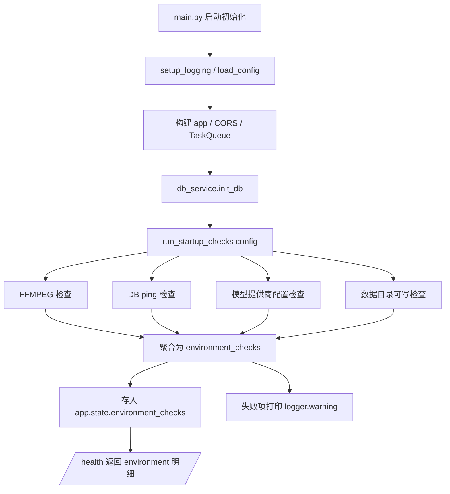

## 用户需求
后台 FastAPI 服务启动时检查当前运行环境是否具备运行要求，失败时不阻断启动，仅输出警告日志，并将检查结果通过 `/health` 端点暴露。

## 产品概述
在 `uvicorn app.main:app` 启动阶段加入一组环境自检，覆盖四项硬性/软性运行依赖；结果汇总为结构化明细，供运维快速判断环境就绪状态，同时保持服务向后兼容、始终可启动。

## 核心功能
- FFMPEG 安装检查：校验 `ffmpeg` / `ffprobe` 可执行（核心系统依赖）。
- 数据库连接检查：按 `config.database.url` 实际建立连接并执行 ping，验证库可达。
- 模型提供商配置检查：`active_provider` 可解析、`base_url`/`model` 非空；无 API Key 时确认可回退 Mock 模式（软性告警）。
- 数据目录可写检查：`data` 目录可创建且具备写权限（SQLite 父目录 / 输出 / 日志）。
- 启动告警：任一检查不通过仅打印 `logger.warning`，进程照常启动。
- `/health` 扩展：新增 `environment` 字段返回各项自检明细（不改动既有字段，保持契约兼容）。


## 技术栈
- 后端：Python 3.14 + FastAPI（沿用现有项目栈，不引入新依赖）。
- 日志：复用 `app.utils.logger.get_logger`，严格遵循 loguru `{}` 占位符规范（由 `backend/scripts/check_logging.py` 静态校验拦截）。
- 数据库联通性探测：复用 `app.db.get_engine(config)` 已缓存引擎，执行 `sqlalchemy.text("SELECT 1")`。
- FFMPEG 探测：直接复用 `app.utils.ffmpeg.is_available()`。

## 实现方案
采用「独立自检模块 + 启动钩子 + 状态挂载」策略：新增 `app/utils/environment.py` 封装四项检查并聚合为结构化结果，在 `main.py` 模块级启动区（紧接 `db_service.init_db(config)` 之后）调用，将结果存入 `app.state.environment_checks`；`/health` 读取该状态新增 `environment` 字段。失败模式为「仅警告继续」，故所有检查统一返回 `status`（`ok`/`warn`/`fail` 及 `detail`），不抛异常终止进程。

### 关键技术决策
- **独立模块而非内联**：四项检查各有独立关注点，独立模块便于单测、复用（CLI 未来也可调用），符合 SoC/KISS。
- **复用既有能力**：FFMPEG 用 `is_available()`；DB ping 复用已缓存引擎；配置校验借助 `AppConfig.active_provider` / `api_key` / `mock_mode` 属性，避免重复逻辑。
- **软硬分级**：FFMPEG 缺失、DB 不可连、目录不可写为 `fail`（严重警告）；API Key 缺失但 `mock_mode=="auto"` 为 `warn`（可降级运行）。无论级别均不中断启动，满足用户「仅警告继续」诉求。
- **向后兼容**：`/health` 仅追加 `environment` 字段，保留原有 `ffmpeg`/`provider`/`database` 等字段，避免破坏前端与其他调用方。

### 性能与可靠性
- 自检仅在进程启动时执行一次（模块级），无运行期热路径开销；DB ping 为单次轻量 `SELECT 1`，成本可忽略。
- 自检异常被各自 `try/except` 捕获并转为 `fail` 状态，防止单项失败阻断整体自检或启动。
- 遵循日志规范，警告信息带上下文（如 url、path），便于定位；不打印敏感凭据。

## 实现备注
- 所有日志必须用 `{}` 占位符（如 `logger.warning("ffmpeg 不可用：{}", detail)`），禁止 f-string / `%` / 拼接，否则 `check_logging.py` 校验失败。
- 数据库 ping 复用 `get_engine(config)`，不要新建引擎；`SELECT 1` 用 `sqlalchemy.text` 包裹，连接用完即关。
- 数据目录检查先调 `config.ensure_data_dir()` 创建父目录，再写临时文件校验可写并清理，避免与 `init_db` 的目录创建冲突。
- 不改变 `main.py` 既有初始化顺序与 CORS / 静态托管逻辑，仅在其后插入自检与状态挂载。

## 架构设计


## 目录结构
```
backend/
├── app/
│   ├── main.py                      # [MODIFY] 启动区调用 run_startup_checks 并将结果存入 app.state.environment_checks；/health 新增 environment 字段（保留原字段）。
│   └── utils/
│       └── environment.py           # [NEW] 自检模块。定义 CheckResult（name/status/detail）与 run_startup_checks(config) -> dict；实现 ffmpeg/db/provider/datadir 四项检查并聚合；失败项 logger.warning，不抛异常。
└── tests/
    └── test_environment.py          # [NEW] 单元测试。覆盖四项检查正常/异常分支、聚合结果结构、mock_mode 降级判定，并验证日志规范。
```

## 关键代码结构
```python
# backend/app/utils/environment.py
from dataclasses import dataclass, asdict

@dataclass
class CheckResult:
    name: str
    status: str   # "ok" | "warn" | "fail"
    detail: str

def run_startup_checks(config: "AppConfig") -> dict[str, CheckResult]:
    """执行全部启动环境检查，返回 name -> CheckResult 映射（不抛异常）。"""
    ...
```

