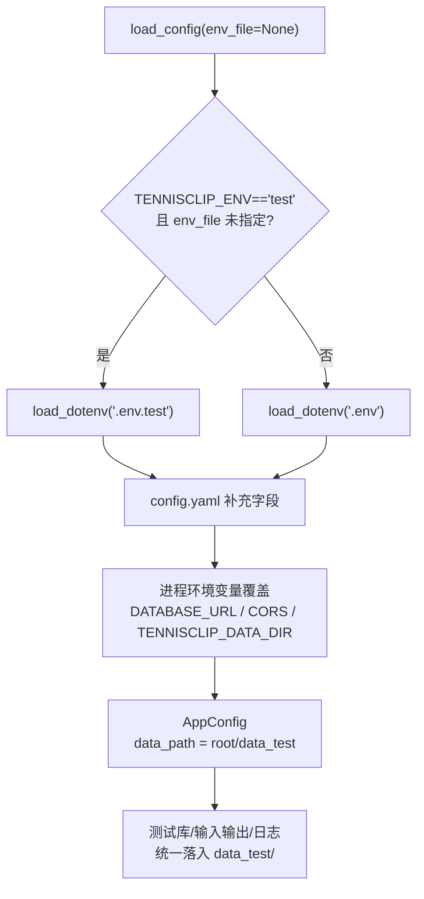

## 用户需求
引入 `.env.test` 实现测试环境与开发/生产配置的彻底隔离。

## 产品概述
为测试运行提供独立的环境配置文件与数据目录，使测试过程完全不触碰真实的开发数据目录，保证开发/生产数据零污染。

## 核心功能
- 新增 `.env.test` 配置文件，测试时优先加载，与 `.env`（开发）/ 生产配置互不干扰
- 测试数据（数据库、输入输出）统一落入 `data_test` 目录，不写入 `data`
- 仅提交 `.env.test.example` 模板，`.env.test` 不入库（被 `.gitignore` 忽略）
- 通过 `TENNISCLIP_ENV=test` 自动切换，既有测试代码中 `load_config()` 调用无需改造即获得隔离


## 技术栈
- Python 3.10+，沿用现有 `python-dotenv`、`pytest`，不引入新依赖
- 配置体系：环境变量 > `.env(.test)` > `config.yaml` > 代码默认值（与现有 `override=False` 优先级一致）

## 实现方案
### 总体策略
在现有 `load_config()` 上扩展环境切换能力，复用既有的 `TENNISCLIP_DATA_DIR` 覆盖机制，使测试配置与数据物理隔离，开发/生产代码路径零改动。

### 关键技术决策
1. **`load_config(env_file=None)` 支持可选参数**：当 `env_file` 未传入且 `os.environ.get("TENNISCLIP_ENV") == "test"` 时，自动加载 `backend/.env.test`，否则加载 `.env`。既保留显式指定能力，又通过 `TENNISCLIP_ENV` 实现自动切换，避免逐个改造测试调用点。
2. **复用 `TENNISCLIP_DATA_DIR` 覆盖链**：`.env.test` 中设置 `TENNISCLIP_DATA_DIR=data_test`，经现有第 260-263 行逻辑覆盖 `paths.data_dir`，测试数据自然落入 `backend/data_test/`，无需新增路径解析逻辑。
3. **`load_dotenv(override=False)` 保持不变**：进程注入（CI/K8s）的环境变量始终优先于 `.env.test`，安全边界不退化。
4. **`conftest.py` 注入测试环境**：pytest 启动时 `os.environ.setdefault("TENNISCLIP_ENV", "test")`，并在会话级 fixture 中调用 `load_config().ensure_data_dir()` 预建 `data_test` 目录（SQLAlchemy 连接 SQLite 前父目录必须存在）。

### 性能与可靠性
- 配置加载为单次文件读取 + 字典填充，O(1) 开销，无性能回归。
- conftest 仅做一次目录创建与一次 `load_config`，影响可忽略。
- `data_test` 被 `.gitignore` 忽略，测试产物不入库、不污染 `data/`。

## 实现要点（防回归）
- **最小改动面**：不改动 `db.py`、`alembic/env.py` 读取逻辑；alembic 在 `TENNISCLIP_ENV=test` 下自然指向 `data_test`，与运行时同源，符合既有设计。
- **`test_db_service_roundtrip` 对齐**：原自建 `backend/test_roundtrip.db`（仓库根遗留）改为使用配置驱动的 `data_test` 目录，彻底隔离并复用 `.gitignore`，避免仓库根散落测试文件。
- **不波及日志校验**：`scripts/check_logging.py` 与 `test_logging_convention.py` 不依赖配置与数据目录，无需改动；`.env.test` 不设置 `TENNISCLIP_LOG_LEVEL`，避免干扰 `test_logging.py` 的级别断言。
- **向后兼容**：未设置 `TENNISCLIP_ENV` 时行为与现状完全一致（加载 `.env`）。

## 架构设计


## 目录结构
```
backend/
├── app/
│   └── config.py              # [MODIFY] load_config 增加 env_file 参数与 TENNISCLIP_ENV=test 自动加载 .env.test；新增 AppConfig.ensure_data_dir()
├── tests/
│   ├── conftest.py            # [NEW] pytest 启动设置 TENNISCLIP_ENV=test，会话级 fixture 预建 data_test 目录
│   └── test_pipeline.py       # [MODIFY] test_db_service_roundtrip 的临时库改为写入 data_test 目录
├── .env.test                  # [NEW, gitignore] 测试配置：TENNISCLIP_DATA_DIR=data_test、DATABASE_URL=sqlite:///./data_test/tennisclip_test.db、占位 API Key
└── .env.test.example          # [NEW, 入库] .env.test 的脱敏模板，供复制使用
.gitignore                     # [MODIFY] 增加 backend/.env.test 与 backend/data_test/
backend/.env.example           # [MODIFY] 注释补充 .env.test / TENNISCLIP_ENV=test / data_test 说明
README.md                      # [MODIFY] 后端环境变量小节补充测试隔离说明
AGENTS.md                      # [MODIFY] 日志/配置约定补充测试环境隔离条目
CHANGELOG.md                   # [MODIFY] 新增 [0.3.x] Added 章节（测试配置隔离）
```

## 关键代码结构
```python
# backend/app/config.py
def load_config(env_file: Optional[str] = None) -> AppConfig:
    """env_file 缺省时：TENNISCLIP_ENV=='test' 加载 .env.test，否则 .env。"""

# AppConfig 新增方法
def ensure_data_dir(self) -> Path:
    """确保统一数据目录（data_test / data）存在，供数据库/输出前置创建。"""
```


## Agent Extensions
### Skill
- **docs-manage**
  - Purpose: 统一更新 README、AGENTS、CHANGELOG 及 .env.example 中关于 `.env.test` / `data_test` 隔离的文档与索引
  - Expected outcome: 文档与代码配置一致，新增测试隔离说明且侧边栏/索引同步
- **git-commit**
  - Purpose: 按 feat(代码) / docs(文档) / test(测试) 原子提交，含版本号与 CHANGELOG 记录
  - Expected outcome: 形成多个独立、符合仓库规范的提交，未推送远程
