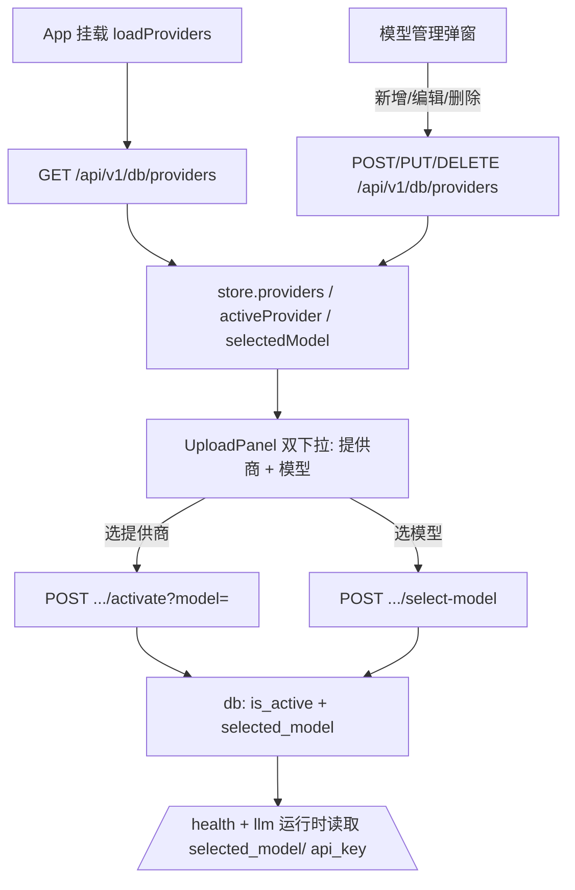

## 用户需求
当前前端仅有单一下拉选择「提供商」，且后端 `model_providers` 表每个提供商仅能配一个模型、密钥只存环境变量名（api_key_env）。需要支持：一个提供商可配置多个模型，并可在线新增/编辑/删除提供商及其多模型；密钥直接入库（接口返回掩码）；用户提交视频时在「提供商 + 具体模型」两个维度上都可选择。

## 产品概述
扩展 TennisClip 的模型提供商体系：后端 `model_providers` 表演进为「每商多模型 + 直接存密钥」结构，新增完整的 CRUD 与选模型接口；前端在上传面板升级为「提供商 / 模型」双下拉，并新增「模型管理」弹窗，支持在线增删改提供商及其多模型。参考 TennisDiary 的 providers/models 设计（name/base_url/api_key/models/json 列表/default_model=首项/enabled/sort_order）。

## 核心功能
- 多模型存储：每个提供商可保存多个模型（JSON 列表），默认模型为首项。
- 在线管理（CRUD）：新增、编辑、删除提供商及其多模型，删除被激活项时拒绝。
- 密钥直存与掩码：api_key 入库明文，列表/详情接口以掩码返回，管理页用密码框填写。
- 双维度选择：上传面板先选提供商（激活），再在该商模型列表选具体模型；两者共同决定本次处理所用模型。
- 即时生效：切换后无需改 `/process` 契约，运行时由数据库 `is_active` + `selected_model` 决定；顶栏状态同步显示。


## 技术栈
- 前端：Vue 3（script setup）+ Pinia + Vite + Tailwind CSS（无新增依赖，沿用既有深色 slate/emerald 风格）
- 后端：Python + FastAPI + SQLAlchemy + Alembic（SQLite/Postgres/MySQL 多兼容）
- 数据：复用既有 `model_providers` 表，Alembic 迁移演进；密钥入库明文（本地单机工具，非多租户）

## 实现方案
采用「表结构演进 + 运行时选模型 + 前端双下拉/管理弹窗」策略：

1. ORM 层为 `ModelProvider` 增加 `api_key(Text)`、`models(JSONList)`、`selected_model(String)`、`enabled(Boolean)`、`sort_order(Integer)`，删除 `api_key_env`、`model`；新增 `JSONList` TypeDecorator（Text 存 JSON 数组，Python 侧透明为 list[str]），`default_model` 属性取 `models[0]`。
2. 运行时解析（`llm.py`/`environment.py`/`/health`）直接读 `api_key` 与 `selected_model or default_model`，不再读环境变量名；`POST /api/v1/process` 不改契约，沿用 DB 生效记录。
3. 激活与选模型合一：`activate_provider(name, model=None)` 设 `is_active=True`、其余 False；传 model 且在列表内则写 `selected_model`，否则取默认。`select_model(name, model)` 在已激活商上更新选中模型。
4. 前端 `UploadPanel` 双 `<select>`（提供商 / 该商模型）；新增 `ProviderManageModal.vue` 做 CRUD，header 加「模型管理」按钮打开；store 增加 `selectedModel` 与管理态字段及 `create/update/delete/selectModel` 动作。

关键决策权衡：
- 用 Alembic 迁移而非手改 DDL，兼容既有库与多数据库；迁移内做数据迁移（旧 `model` → `models=[model]`、`selected_model=model`、`api_key=''`），旧库无明文密钥由用户在 UI 补填。
- 沿用「DB is_active 为唯一事实来源」架构，避免 `/process` 增加参数，最小化对全链路流水线的改动。
- 静态配置兜底（`ProviderConfig`）增 `models` 字段，缺省 `[model]`，保证无 DB 时仍可解析。

## 实现要点
- `JSONList` 复用 TennisDiary 的 `process_bind_param/process_result_value`，对空/非 list 做容错返回 `[]`。
- 新增 `mask_secret` 工具（保留前后各若干位，中间 `****`），列表与详情接口对 `api_key` 掩码；`update_provider` 中 `api_key` 留空表示保留原值。
- 校验：`name` 唯一且非空、`base_url` 须 `http(s)://`、`models` 至少 1 项（逐项 trim 去空）；`delete_provider` 对 `is_active` 项返回 409。
- 迁移使用 `op.batch_alter_table` 兼容 SQLite（add 列 → 数据迁移 → drop 旧列）。
- 前端 `api.js` 统一经 `url()/parse()/ApiError`；管理弹窗表单 `models` 以换行/逗号分隔输入，提交时 `split` 为列表。

## 架构设计


## 目录结构
```
backend/app/
├── db_models.py            # [MODIFY] 新增 JSONList；ModelProvider 改列（加 api_key/models/selected_model/enabled/sort_order，去 api_key_env/model）；_seed_providers 写新列
├── alembic/versions/<new>.py  # [NEW] 迁移：add 列 → 数据迁移 → drop 旧列（batch 兼容 SQLite）
├── services/db_service.py  # [MODIFY] list_providers(排序)、create/update/delete_provider、activate_provider(name, model?)、select_model、get_active_provider(返回 selected_model)、mask_secret
├── main.py                 # [MODIFY] GET providers 新 shape+掩码；新增 POST/PUT/DELETE /api/v1/db/providers；activate 接受 model；/health 用 api_key/selected_model
├── utils/llm.py            # [MODIFY] _resolve_provider 用 db_p.api_key 与 selected_model or default_model（DB 分支）；静态分支用 models[0]
├── utils/environment.py    # [MODIFY] _resolve_effective_provider 用 db_p.api_key 与 selected_model or default_model
└── config.py               # [MODIFY] ProviderConfig 增 models；_build_provider_list 填充 models = item.get('models') or [item.get('model')]
frontend/src/
├── lib/api.js              # [MODIFY] listProviders/activateProvider(name, model?) 扩展；新增 createProvider/updateProvider/deleteProvider/selectModel
├── stores/task.js          # [MODIFY] 加 selectedModel 与管理态；动作 create/update/delete/selectModel，刷新列表与 health.provider
├── components/UploadPanel.vue   # [MODIFY] 双下拉（提供商+模型），模型随所选 provider 的 models 更新
├── components/ProviderManageModal.vue  # [NEW] 列表 + 新增/编辑表单 + 删除确认，调用 store 动作
└── App.vue                 # [MODIFY] header 加「模型管理」按钮切换弹窗
docs/
├── plans/05-模型提供商多模型管理.md  # [NEW] 方案文档（📋→🚧→🏁）
├── README.md               # [MODIFY] 目录结构/文档一览/执行进度
└── .vitepress/config.mts   # [MODIFY] 侧边栏新增 05
AGENTS.md                   # [MODIFY] API 契约表新增/改接口与字段变化
```

## 关键代码结构
```python
class JSONList(TypeDecorator):
    """Text 列存 JSON 数组，Python 侧透明为 list[str]"""
    impl = Text
    cache_ok = True
    def process_bind_param(self, value, dialect):
        if value is None: return "[]"
        if isinstance(value, str): return value
        return json.dumps(list(value))
    def process_result_value(self, value, dialect) -> list[str]:
        if not value: return []
        try: parsed = json.loads(value)
        except (TypeError, ValueError): return []
        return [str(m).strip() for m in parsed if str(m).strip()]

class ModelProvider(Base):
    __tablename__ = "model_providers"
    id: Mapped[int]
    name: Mapped[str]                 # 唯一、直选键
    base_url: Mapped[str]
    api_key: Mapped[Optional[str]]    # 直接存密钥（明文）
    models: Mapped[list[str]]         # JSONList
    selected_model: Mapped[Optional[str]]
    is_active: Mapped[bool]
    enabled: Mapped[bool] = default True
    sort_order: Mapped[int] = default 0
    created_at / updated_at
    @property
    def default_model(self) -> str: return self.models[0] if self.models else ""
```


## 设计风格
沿用现有深色科技风（slate-950 渐变背景 + emerald 强调色 + 玻璃拟态圆角卡片）。新增「模型管理」弹窗与「上传面板双下拉」保持视觉一致：弹窗为居中玻璃拟态面板（backdrop-blur + border-slate-800 + bg-slate-900/80），内部卡片采用圆角 2xl、label 在左控件在右；下拉/输入框统一深色 slate-800/900 背景、emerald-400 聚焦高亮；删除等危险操作用 red 系提示。整体响应式、微交互（hover/聚焦过渡）、不干扰上传主流程。

## 页面规划
- 上传面板（UploadPanel）：原「模型」块升级为两行——第一行左侧「提供商」右侧 `<select>`（选项 name），第二行左侧「模型」右侧 `<select>`（选项为该商 models，默认选中 selected_model）；切换中禁用下拉。
- 模型管理弹窗（ProviderManageModal）：顶部标题「模型提供商管理」+ 关闭按钮；列表区展示各提供商卡片（名称、base_url、模型数、启用开关、编辑/删除按钮）；表单区含 name、base_url、api_key（password 框）、models（textarea 每行一个）、enabled、sort_order；底部「保存/取消」。新增与编辑复用同一表单。
- 顶栏（App.vue header）：右上角新增「模型管理」按钮（emerald outline），点击切换弹窗显隐。


## Agent Extensions
### Skill
- **docs-manage**
  - Purpose: 新建方案文档 `docs/plans/05-模型提供商多模型管理.md`（含头信息/变更历史/执行进度），并同步 `docs/README.md` 与 `docs/.vitepress/config.mts` 侧边栏
  - Expected outcome: 方案文档状态从 📋 待执行推进到 🏁 已完成，README 文档一览/执行进度与 VitePress 侧边栏均包含 05 条目，校验脚本无遗漏
