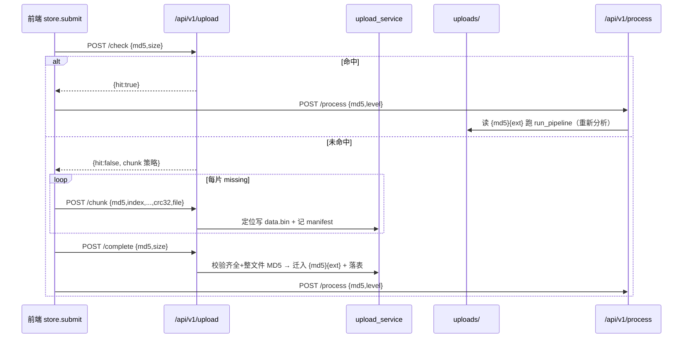

# 两步上传与 MD5 秒传

> **本页信息**
>
> | 项目 | 内容 |
> |------|------|
> | 文档编号 | 06 |
> | 文档版本 | v1.0.1 |
> | 文档状态 | 🏁 已完成 |
> | 最后更新 | 2026-09-18 |
> | 对应功能/内容 | 视频两步上传 + MD5 命中秒传（复用已落盘视频重新分析） |
>
> **变更历史**
>
> | 日期 | 版本 | 说明 |
> |------|:----:|------|
> | 2026-09-18 | v1.0.1 | 补实现前端自动重试（单片 400 / 整文件 409 重传），并澄清整文件 MD5 自洽校验语义、补充 `CHUNK_MAX_BYTES`+413 与阈值字段说明 |
> | 2026-09-18 | v1.0.0 | 初版，功能已实现并提交（commit 2f02662） |
>
> **关联文档**：[01-需求分析与落地方案](./01-需求分析与落地方案.md)、[架构总览（任务处理流程）](../architecture/index.md)、[AGENTS.md API 契约](../../AGENTS.md)、[README.md 接口](../../README.md)

## 一、背景与目标

TennisClip 为本地单机工具，视频上传每次都要把完整文件传一遍，弱网/超大视频体验差，且同一视频反复上传浪费流量。参考 TennisDiary 上传子系统，引入「两步上传 + MD5 秒传」：

- **秒传**：前端计算文件 MD5，预检命中则跳过上传，直接复用服务端已落盘视频重新跑分析流水线，生成新结果（节省上传流量，仍需推理时间）。
- **断点续传**：未命中时按 5MB 分片上传，单片带 crc32 校验，可按进度对缺失片续传，合并后整文件 MD5/size 二次校验（自洽校验，防传输/合并损坏）。
- **去重存储**：成品以 `{md5}{ext}` 命名，同内容单份；新增 `uploaded_videos` 表做映射与库/文件双重命中判定。
- **向后兼容**：保留原 `file` 整体直传路径，CLI 与旧调用不受影响。

## 二、方案设计

### 存储布局（沿用参考默认）

```
{data_path}/
└── uploads/
    ├── {md5}{ext}              # 最终成品（去重命名）
    └── _chunks/{md5}/
        ├── data.bin            # 分片会话：按 offset=index*chunk_size 定位写，即最终文件
        └── manifest.json       # 权威账本（ok/failed/missing）
```

`data.bin` 采用定位写，本身就是最终文件，`/complete` 无需再做合并拷贝，仅做一次整文件 MD5 校验。

### 分片策略（单一真源）

| 参数 | 值 |
|------|-----|
| `CHUNK_SIZE_BYTES` | 5MB |
| `CHUNK_THRESHOLD_BYTES` | 20MB（低于阈值仍走分片，保持一致行为） |
| `MAX_CHUNK_COUNT` | 512 |

> 补充说明：`CHUNK_THRESHOLD_BYTES`（20MB）仅作为策略下发字段，前端恒定 5MB 分片、不据此分流；代码另含上表未列出的 `CHUNK_MAX_BYTES=20MB` 单片上限，对应 `ChunkTooLargeError → 413`（因前端固定 5MB 分片，实际不触发，属冗余安全网）。整文件 MD5 校验为「客户端声明 MD5 ↔ 实际落盘 MD5」的**自洽校验**，用于捕捉传输/合并损坏——服务端并不持有权威 MD5，故其意义是防损坏而非防篡改。

`manifest.json` 写盘 + 校验 + fsync 通过才入账 `ok`，失败入 `failed`，作为断点续传的唯一真源。

### MD5 去重表

```python
class UploadedVideo(Base):
    __tablename__ = "uploaded_videos"
    md5 = Column(String(32), primary_key=True)   # MD5 命名与秒传依据
    ext = Column(String(16), default=".mp4")
    size_bytes = Column(Integer, default=0)
    original_name = Column(String(255), default="")
    rel_path = Column(String(512), nullable=False)  # 相对 data_path
    created_at = Column(Float, default=0.0)
```

预检命中判定：`find_by_md5` 命中 **且** 物理文件存在，避免「库有记录但文件丢失」误判。

### 前端增量 MD5

浏览器用 `spark-md5`（Web Crypto 不支持 MD5）按 `Blob.slice` 切片读取，边读边算 MD5，切片上传与 MD5 计算复用同一遍读取，避免二次读盘。

### 全链路流程



## 三、实施步骤

- [x] Step 1：新增 `UploadedVideo` 模型，生成并人工审查 Alembic 迁移（剔除 autogenerate 误带的 `ai_providers` 改动）
- [x] Step 2：实现 `upload_service` 门面（分片会话 data.bin + manifest、MD5 落盘去重、register/complete、crc32 与整文件 MD5 校验）
- [x] Step 3：新增 `routers/upload.py`（`/check` `/chunk` `/chunks` `/complete`），路由层统一经门面，不自行拼路径/写盘
- [x] Step 4：改造 `main.py` 的 `process_video` 新增可选 `md5` 字段，命中则复用已落盘视频；保留 `file` 兜底
- [x] Step 5：前端新增 `utils/md5.js`（spark-md5 增量计算 + 切片 + crc32），`lib/api.js` 两步编排，`stores/task.js` 重写 `submit` 状态机；并对单片 400（crc 不符）/整文件 409 做自动重试（v1.0.1 落实）
- [x] Step 6：`UploadPanel.vue` 新增「秒传命中 / 上传进度 / 分析中」状态区与按钮随阶段变化
- [x] Step 7：新增 `tests/test_upload.py`（预检命中/未命中、分片+complete、断点续传、整文件 MD5 不符 409、秒传复用、未知 md5 400），5 passed
- [x] Step 8：更新 `AGENTS.md` API 契约、`README.md` 接口表、`CHANGELOG.md`（0.8.0 Added），根 `package.json` 升 0.8.0，原子提交 `2f02662`

## 四、验收标准

- [x] 同一视频（MD5 相同，与文件名/分析层级无关）二次提交：首次上传落盘，二次预检 `hit=true` 跳过上传并重新分析，生成新 `task_id`
- [x] 未命中时分片上传可完成，`/complete` 返回 `{md5, rel_path, ext, original_name}`，成品以 `{md5}{ext}` 命名且单份
- [x] 单片 crc32 不符自动重试该片（最多 3 次）；整文件 MD5/size 不符返回 409，前端自动重传非法段（最多 3 次），仍失败才报错（v1.0.1 落实）
- [x] `GET /chunks` 返回 `ok/failed/missing`，仅上传缺失片即可续传
- [x] 原 `POST /process` 带 `file` 整体直传仍可用（向后兼容）
- [x] 日志严格走 `loguru {}` 占位，无 f-string；新增库/视频被 `.gitignore` 忽略

## 五、风险与应对

| 风险 | 影响 | 应对方案 |
|------|------|---------|
| 整文件 MD5 校验开销 | 大视频合并时 O(n) 读盘 | 视频≤5 分钟可接受；仅 complete 阶段做一次 |
| 分片传输损坏 | 成品损坏 | 单片 crc32 校验 + 整文件 MD5 自洽校验，不符即 409；前端自动重试该片 / 重传非法段（最多 3 次） |
| 库有记录但文件丢失 | 误判命中 | 预检双重判定（库记录 + 物理文件存在） |
| 前端大文件 MD5 计算卡顿 | 交互阻塞 | 增量切片计算，避免二次读盘；必要时可 Web Worker（后续优化） |
| 后台流水线线程在测试退出后写日志 | 测试噪声 | 良性告警，不影响断言；伪视频 ffmpeg 失败为预期 |

## 六、关联文档

- [01-需求分析与落地方案](./01-需求分析与落地方案.md)：整体需求与落地路线
- [架构总览（任务处理流程）](../architecture/index.md)：上传→创建任务→后台异步→轮询的错误传播机制
- [AGENTS.md API 契约](../../AGENTS.md)：`/api/v1/upload/*` 与 `process` 的 `md5` 参数定义
- [README.md 接口](../../README.md)：对外接口表同步说明
