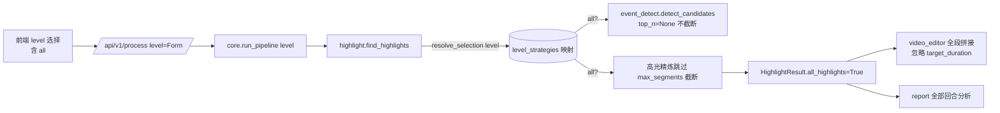

# 分析分层挂钩高光

> **本页信息**
>
> | 项目 | 内容 |
> |------|------|
> | 文档编号 | 07 |
> | 文档版本 | v1.0.0 |
> | 文档状态 | 📋 待执行 |
> | 最后更新 | 2026-09-19 |
> | 对应功能/内容 | 分析分层 level 驱动高光选择策略，新增「所有高光回合」档位 |
>
> **变更历史**
>
> | 日期 | 版本 | 说明 |
> |------|:----:|------|
> | 2026-09-19 | v1.0.0 | 初版 |
>
> **关联文档**：[05：高光候选定位方案](./05-高光候选定位方案.md)、[04：模型服务商管理](./04-模型服务商管理.md)

## 一、背景与目标

当前「分析分层」`level`（beginner / intermediate / professional）仅作为 Prompt 口径（动作分析深度）贯穿 `find_highlights` 与 `report.generate_report`，**不参与高光选择**；高光数量完全由 `highlight.max_segments`（默认 3）与 `highlight.target_duration`（默认 15s）决定。即使用户选了「专业」层级，集锦也只会截取前 3 段高光、且总时长被截断到 15s，无法覆盖整段视频的全部回合。

本方案目标：

- 将 `level` 作为高光选择的**驱动维度**，beginner / intermediate / professional 各对应不同的高光数量档位（维持现状语义、零回归）。
- 新增 **`all`（所有高光回合）** 档位：遍历整段视频、截取并拼接**全部**高光时刻，不受 `max_segments` 与 `target_duration` 约束。
- 配置（`config.yaml`）提供默认策略，API 请求参数 `level` 可在运行时覆盖（前端上传面板可选），后端解析优先级保持 **API > 配置 > 代码默认**。
- 前端上传面板新增「所有高光回合」选项，随 `level` 一并提交。

适用范围：TennisClip AI 后端高光识别 / 剪辑 / 报告链路，及前端上传页；不改动数据库 schema（`TaskResult.level` 已记录 level，`all` 自然落库）。

## 二、方案设计

核心思路：在 `HighlightConfig` 中引入「level → 高光选择策略」映射表，由 `find_highlights` 解析当前 level 得到选择策略（`max_segments` 覆盖 / `all_highlights` 开关），并将 all 信号向下游（候选定位、剪辑、报告）传递。

### 2.1 策略映射（配置层）

`HighlightConfig` 新增 `level_strategies` 字典（随 config.yaml 入库可改）；新增 `resolve_selection(level)` 统一解析，避免业务逻辑散落硬编码。

```python
# backend/app/config.py —— HighlightConfig 新增
level_strategies: dict = field(default_factory=lambda: {
    "beginner":     {"max_segments": 2},
    "intermediate": {"max_segments": 3},
    "professional": {"max_segments": 5},
    "all":          {"all_highlights": True},
})

def resolve_selection(self, level: str) -> dict:
    """返回该 level 的高光选择策略：{max_segments, all_highlights}。"""
    strat = self.level_strategies.get(level, {})
    return {
        "max_segments": strat.get("max_segments", self.max_segments),
        "all_highlights": bool(strat.get("all_highlights", False)),
    }
```

`config.yaml` 同步：
- `report.levels` 增加 `"all"`：`[beginner, intermediate, professional, all]`。
- `highlight` 段新增 `level_strategies` 映射（如上）。

### 2.2 all 信号作为唯一事实来源

`HighlightResult` 新增 `all_highlights: bool = False` 字段，`find_highlights` 在 all 档位置 `True`。`video_editor` 与落库据此判断是否全段拼接，比 `target_duration=0` 哨兵更语义清晰、可审计。

```python
# backend/app/models.py —— HighlightResult 新增字段
class HighlightResult(BaseModel):
    segments: List[Segment] = Field(default_factory=list)
    target_duration: int = Field(default=15, description="集锦目标时长（秒）；all 模式忽略")
    scene_type: str = Field(default="unknown")
    reasoning: str = ""
    all_highlights: bool = Field(default=False, description="all 档位：全段截取所有高光回合")
```

### 2.3 候选不截断

`event_detect.detect_candidates` 新增可选 `top_n: int | None = None` 参数，None 时不按 `candidate_top_n` 截断（保留全部合并候选）。all 模式调用方传 `top_n=None`。不改动 `_STRATEGY_ORDER` / `_STRATEGIES` 管线结构。

### 2.4 全量覆盖兜底

all 模式下即便 LLM 未返回某候选窗口的高光，也以候选窗口本身补齐（复用 `_clamp_to_candidates` 的候选回退逻辑），确保「遍历整段、截取所有高光时刻」语义达成。

### 2.5 Prompt 扩展

`build_highlight_prompt` 增加 `select_all` 开关，all 模式指示模型「每个候选窗口均为真实动作回合，请全部返回，在各自 ±2s 内精修」，其余模式行为不变。

### 2.6 数据流向



## 三、实施步骤

- [ ] Step 1：配置层——`HighlightConfig` 加 `level_strategies` 与 `resolve_selection`；`config.yaml` 的 `report.levels` 加 `all`、`highlight` 加 `level_strategies`。
- [ ] Step 2：模型层——`HighlightResult` 加 `all_highlights` 字段。
- [ ] Step 3：候选层——`event_detect.detect_candidates` 加 `top_n: int | None = None`，None 不截断。
- [ ] Step 4：高光层——`highlight.find_highlights` 解析策略；all 模式跳过 `_clamp_to_candidates`/`_clamp_segments` 的 `max_segments` 截断、置 `all_highlights`、候选回退补齐。
- [ ] Step 5：Prompt 层——`build_highlight_prompt` 加 `select_all`，all 模式追加全量返回约束。
- [ ] Step 6：剪辑层——`video_editor.edit_highlight_video` 在 `hl.all_highlights` 时全段拼接、忽略 `target_duration`。
- [ ] Step 7：报告层——确认 `report` 对 all 档位兜底 intermediate 口径，基于全部回合分析（最小改动）。
- [ ] Step 8：API——`/api/v1/process` 增加 level 合法值校验（beginner/intermediate/professional/all，非法返回 400）。
- [ ] Step 9：前端——`UploadPanel.vue` 的 `LEVELS` 新增 `{ value: 'all', label: '所有高光回合' }`。
- [ ] Step 10：测试——补充 `test_event_detect`（top_n=None 返回全部候选）、`test_pipeline`（all 档位 segments 不截断、拼接忽略时长）用例；跑 `check_logging.py` 与 `pytest`。

## 四、验收标准

- [ ] `level=all` 提交后，集锦视频覆盖整段视频全部高光回合，`highlight.segments` 不被 `max_segments` 截断、`highlight_video` 时长不被 `target_duration` 截断。
- [ ] beginner / intermediate / professional 档位高光数量策略与映射表一致（默认 2 / 3 / 5），行为相对现状零回归。
- [ ] 报告阶段对 all 档位自然兜底到 intermediate 口径，并覆盖全部回合。
- [ ] 前端上传面板出现「所有高光回合」选项，提交后 `level=all` 正确传入后端。
- [ ] `uv run python backend/scripts/check_logging.py` 与 `uv run pytest tests/` 均通过。
- [ ] `config.yaml` 默认策略可被 `/api/v1/process` 的 `level` 参数覆盖（API 优先）。

## 五、风险与应对

| 风险 | 影响 | 应对方案 |
|------|------|---------|
| all 模式候选数增多导致集锦过长 | 超出「1–5 分钟视频」时长范围 | 候选已是聚类后真实动作窗口（音频击球+运动爆发），量级有限；LLM 抽帧 `max_frames=16` 不变；后续可按 `max_input_seconds` 兜底 |
| LLM 漏返部分候选窗口高光 | 「全部回合」语义未达成 | all 模式以候选窗口本身补齐（`_clamp_to_candidates` 回退逻辑） |
| level 非法值传入 | 策略解析异常 | `/api/v1/process` 增加合法值白名单校验，非法返回 400 |
| 日志规范被破坏 | CI 静态拦截失败 | 改动统一使用 loguru `{}` 占位符，经 `check_logging.py` 回归 |

## 六、关联文档

- [05：高光候选定位方案](./05-高光候选定位方案.md)——候选定位信号管线（`detect_candidates` / `top_n` 截断点）
- [04：模型服务商管理](./04-模型服务商管理.md)——配置 KV 驱动与 `level` 运行时覆盖机制
